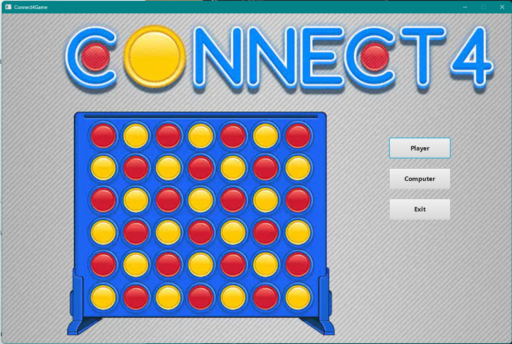
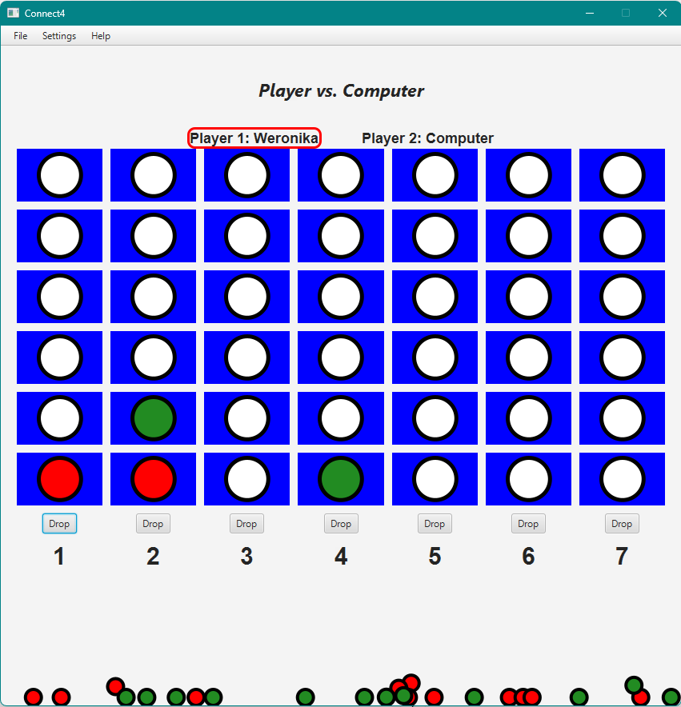

# Connect4 (JavaFX Game)

This is a fully-featured Connect 4 game built using JavaFX and Java 18. The game includes:
- Player vs Player and Player vs AI (Easy, Medium, Hard)
- Animations, sound effects, and game piece interactions
- A polished, responsive user interface
- A custom physics-based animation

## Download & Play

You don’t need to build the game yourself — you can download a pre-built version from the [Releases](https://github.com/wgolden117/Connect4_Local_GamePlay/releases/tag/v1.0.0) page.

### Windows
- **Portable App (.exe)**  
  Just download the `.exe` file, double‑click, and start playing!
    - No installation required
    - Great if you just want to try the game quickly

- **Windows Installer (.msi)**  
  Download the `.msi` installer if you’d like the game added to your Start Menu like a normal application.
    - Standard Windows install/uninstall
    - Creates shortcuts

**Note:** Since this is a student‑made game, Windows will warn that the publisher is untrusted. This is expected and safe to ignore. You can proceed by clicking **“More Info → Run Anyway.”**

### Build from Source
If you prefer, you can also build and run the game locally:
1. Clone the repository:
   ```bash
   git clone https://github.com/YOUR_USERNAME/Connect4_Local_GamePlay.git
   cd Connect4_Local_GamePlay
   ```
2. Run the build script:
   ````bash
   build-and-run.bat
    ````

## Requirements
- Windows 10 or later
- No need to install Java — a custom runtime is bundled!

## How It Was Built
- Java 18 + JavaFX
- Custom runtime image created using `jpackage`
- Physics and animations written from scratch
- SpotBugs and Checkstyle used for code quality

## Author
Weronika Golden – Built as part of a software engineering portfolio project

## Screenshots

